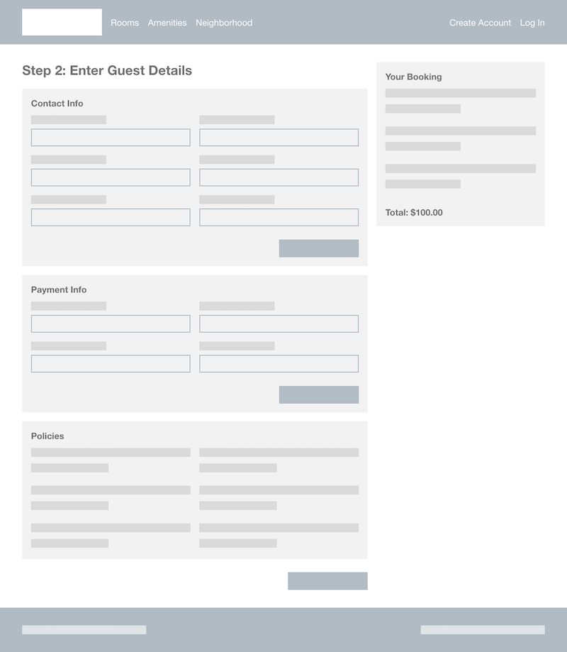
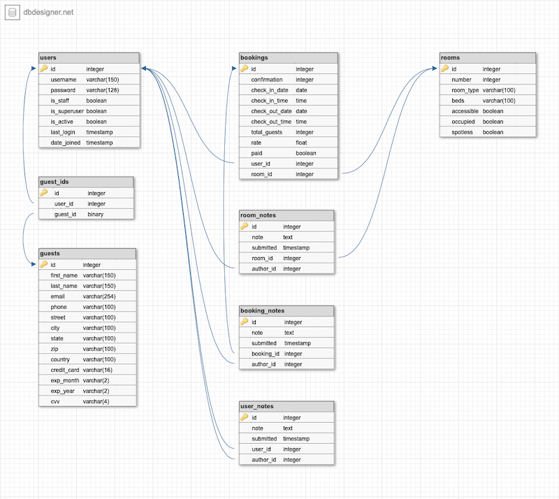

# Base

Hotel website and hotel management app

## Planning

### Wireframes

URL: /

URL: /booking/step1

URL: /booking/step2

URL: /booking/:id/confirmation

URL: /create-account

URL: /guest/:id/profile

URL: /employee/:id

URL: /employee/:id/booking/:id

### Database ERD

### User Stories

<!-- prettier-ignore -->
| Story | Type |
| - | - |
| As a potential guest, I want to see lots of photos of the hotel's rooms and common areas, so I can get a sense of the hotel's style and decide whether it's someplace I want to stay. | Guest |
| As a potential guest, I want to see a comprehensive list of the hotel's amenities, so I can know whether it will have what I want, like a gym. | Guest |
| As a potential guest, I want to see a map of where the hotel is located, so I can determine whether it's close to where I want, or need, to be. | Guest |
| As a potential guest, I want to learn about the area around the hotel, so I can know whether there will be things to do nearby. | Guest |
| As a guest who has decided to book a stay, I want to see multiple photos of every room type, so I can pick a room I know I'll be happy with. | Guest |
| As a guest who has decided to book a stay, I want to see the total cost of my future stay, and its breakdown, prior to booking, so I can determine whether the price is fair and something I can afford. | Guest |
| As a guest who has booked a future stay, I want to see the details of all my bookings, so I can confirm their accuracy and reference them prior to my stay. | Guest |
| As an employee who manages bookings, I want to make, change, and cancel bookings on behalf of guests, so I can help them when they contact the hotel. | Employee |
| As an employee who manages bookings, I want to see whether the hotel has available rooms on any given day, so I can help guests make or change a booking. | Employee |
| As an employee who manages bookings, I want to be able to add notes to a booking, as well as a guest's profile, so I can record guest requests and preferences. | Employee |
| As a housekeeping employee, I want to see a list or graph of the rooms that need to be cleaned or turned over, so I can plan my shift accordingly. | Employee |
| As a housekeeping employee, I want to notify other employees when I've turned over a room, so they can finalize check-in and give the next guest a key. | Employee |
